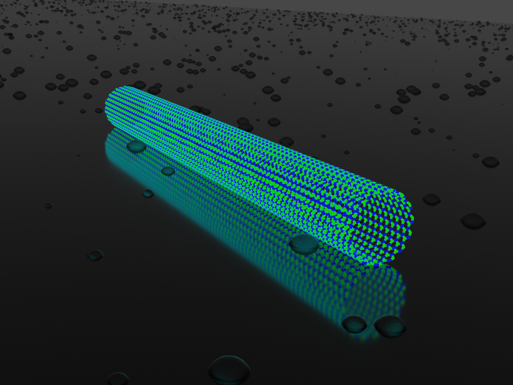

# Boron Nitride membrane creator
This folder consists of utilites to generate components of a
boron nitride membrane.


## BNNT creator
The file "bnntcreator.cpp" consists of a C++ script which
generates a boron nitride nanotube. The nanotube is 
generated by first creating a planer sheet, then rolling it
about the chiral axis. 

To compile:
```
g++ bnntcreator.cpp
```
To run: 
```
./a.out m n length
```
Where 'm,n' is the nanotube chirality, and 'length' is the
nanotube length.

## Hydrogenised pore creator
The file "h_pore_creator.cpp" consists of a C++ script which
takes an existing 2-D boron nitride sheet and creates a 
pore in the shape of an n-sided polygon at the centre of the 
sheet. It tries to ensure that parity is maintained between
the number of boron and nitrogen atoms in the sheet. Finally,
dangling bonds due to the pore creation are identified and 
hydrogenised.

To compile: 
```
g++ h_pore_creator.cpp
```
To run: 
```
./a.out
```
